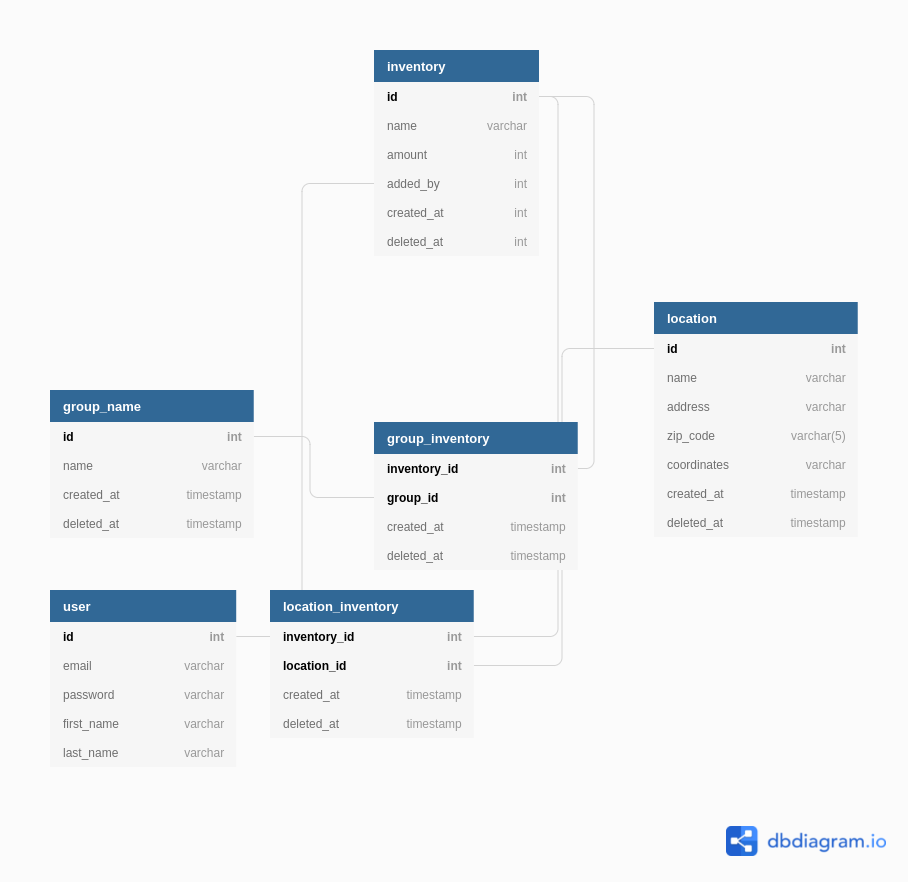
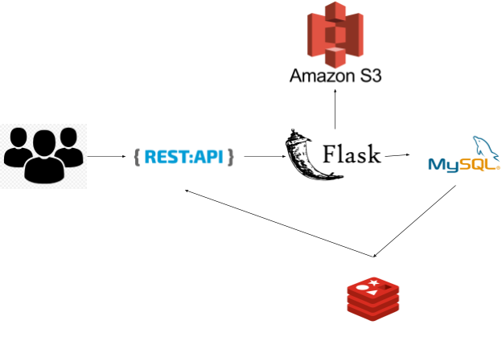

# Shopify Backend Challenge

> Demo Link: 

## Introduction
- --
- The project was designed and built based on the requirements of **Shopify Backend Challenge**
- Link: https://docs.google.com/document/d/1z9LZ_kZBUbg-O2MhZVVSqTmvDko5IJWHtuFmIu_Xg1A/edit#
- Features completed so far:
  - Basic CRUD Functionality to interact with Inventory data
  - Allow image uploads and store image with generated thumbnails
  - When deleting, allow deletion comments and undeletion

> **NOTES**: For Shopify Submission, I would love to use the third option: ***Deletion and undeletion comments***

- Features I am working on:
  - Create warehouses/locations and assign inventory to specific questions
  - Assign/remove inventory items to a named group/collection
  - Push a button export product data to a CSV
- Technology I am using in this project: ***Flask, Python, SQLAlchemy(ORM), MySQL, Docker, Docker-Compose, AWS S3***
- I don't have enough time to implement ***test*** API. I will include in the future.
## Database Design
- --
- Link to database design:

- Based on the requirements from the link, I have come up with 4 schemas represent for 4 different entities with 2 association schemas: USER, INVENTORY, GROUP_NAME, LOCATION
  - User:
    - User schema has fields: id, email, password, first_name, last_name; represent basic information for authenticate user.
    - Due to time limitation, I did not get a change to implement authentication flow. In the future, if I will definitely update with SSO and authentication using email.
    - Since in the USER table, I will mainly search on *ID* and *email* fields, I will index these two.
  - Inventory:
    - Inventory schema has fields: id, name, amount, created_at, deleted_at, image_name, added_by; represent basic information of an inventory.
    - I index 4 fields, since I will mainly query based on these fields: **id, added_by, created_at, deleted_at**
    - *added_by* is a field contains a Foreign Key to USER schema, since I think it is better for someone to be able to know who is in charge if uploading information of the inventory.
    - *image_name* will contain a UUID of an uploaded image in AWS S3 so we can get the presigned image link in the S3 when query.
    - *deleted_at* and *created_at* will store the number of seconds in UTC. 
    - *deleted_at* will always be NULL at the beginning, so whenever we want to implement soft delete, we can fill the row with timestamp in seconds data. If we want to undelete, we can make the this field NULL again.
  - Group:
    - (Coming Soon)
  - Location:
    - (Coming Soon)

## System Design
- --
- Below is the sketch of how I design this small application

- The system I am having right now was built based on Flask(Python) framework. 
- I used MySQL as a primary database since I am most familiar with this database. 
- I configure Redis as a caching service, which will cache and update data after every 15 seconds, to reduce number of query to the primary database and improve the speed of API.
- Amazon S3 will be the tool for me to store Images and everytime we make query to retrieve the image, we will get the presigned link which will expire after a period of time.
- Each service will be deployed and run in different containers and share the same network.
- When we scale up the application, we can use **Replication**, so the Master database will take in charge of inserting the data, while the slaves will be in charge of reading the data. 
- There will be an underlaying process to replicate data from the Master database to the Slaves in every 30 seconds.

## Documentation
- --
- You can find the documentation for the application in this link: https://app.swaggerhub.com/apis-docs/nhd36/ShopifyChallenge/1.0.0 (Continue to update)

## Setup
- --
- Make sure that you filled out all the requiring fields based on ***.env.format***
### Setup Manually with Local Machine
- The machine that I am using right now is Ubuntu 20.04. For those who run in different OS, I don't really know if setup will work, so I recommend running the Docker setup below.
- Make sure that you have Python >= 3.6 in your machine, for those lower version of Python, I do not guarantee that it will run smoothly.
- Create virtual environment for your project:
  > python3 -m virtualenv venv
- Activate your virtual environment
  > pip3 install -r requirements.txt
- Run script with **start.sh**
  > ./start.sh
  #### Enjoy!

### Setup with Docker
- Your machine must have *Docker* installed to be able to run this setup.
- We make a little change in .env file in order to be able to connect different containers in Docker system.
  > DB_HOST=db
  > 
  > DB_PORT=5432
  >
  > **NOTES**: You can customize the docker-compose file to fit with your technology services 
- To run on *dev* environment, we will use ***docker-compose***
  > source ./env/.env && docker-compose -f docker-compose.yml up

  #### Enjoy!